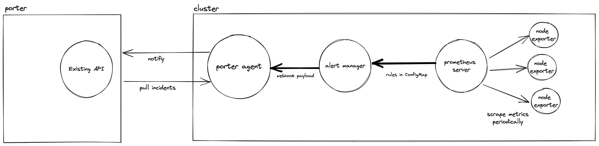

# Alerts from Clusters

* Owner: Muvaffak Onus (@muvaf)
* Reviewers: Porter Maintainers
* Status: Accepted

## Background

Porter deploys a tool called `porter-agent` to application clusters as a tool to
monitor the cluster and report back to Porter. It is a set of Kubernetes controllers
that watch for events and report them to Porter. However, Kubernetes does not
publish events for all the issues users may want to be notified about. For example,
irregular and unexpected CPU usage, memory leaks, etc. are not reported as events. 

## Goals

Users should be notified about irregularities in their clusters that are not
captured with built-in Kubernetes events.

## Proposal

We will have `porter-agent` expose an API that can be used by `alert-manager`
deployed in the cluster to send alerts via its
[webhook integration][alert-manager-webhook-config]  and then `porter-agent`
could handle the rest of the delivery to Porter in the same way it handles events
it scrapes from the cluster today.



The bold arrows in the diagram represent the new flows that will be implemented.

### Implementation

We will add a new `POST` handler to `porter-agent` that can accept alert-manager
webhook payload and save it as incident. It should use the upstream `alert-manager`
type definitions to unmarshal the payload and convert it to its own `Incident`
type.

The Prometheus community add-on chart should have built-in alerting rules that
have general rules such as CPU spike alert hard-coded. In the future, we may opt
to allow users to add more rules. The biggest challenge here is that we need to
account for a wide range of usage patterns so that save most users from having
to configure their own rules. For example, we cannot just have a rule that will
fire an alert when CPU usage is above 80% of the container limit because container
may not even have a limit or we should not fire an alert immediately for the
short-lived spikes because they may be normal.

The initial hard-coded rules are listed below. The exact numbers to be
calibrated with real-world usage. For example, we would not want to fire an alert
when container just gets started and CPU usage is high for a short period of time.
* CPU spike alert that will fire when average usage of the CPU in the last 3
  minutes is 3 times of the average usage of the last 10 minutes. We do not want
  to account for CPU usages under `0.5` since the rate is very noisy below that
  level.
    ```promql
    sum by (namespace, pod, container) (
      rate(container_cpu_usage_seconds_total{container!=""}[3m]) > 0.5 /
      rate(container_cpu_usage_seconds_total{container!=""}[10m]) > 0.5
    ) * on (pod, namespace) group_left(node) (kube_pod_info) > 3.0
    ```
    Example label set on returned data:
    ```
    {container="web", namespace="default", node="kind-control-plane", pod="stressing-the-cluster-web-6b457d4774-plfkn"}
    ```

Next, we should configure a new receiver for `alert-manager` via the 
`webhook_config` receiver in the Helm chart of the Prometheus community add-on
so that it sends requests to the `porter-agent` service.

### Testing

A sample stress simulator application can be deployed via Porter and synthetic
CPU load could be produced by it. We can then check if the alerts are fired as
expected. By reducing the threshold in the alerting rule to `0.1`, we can make
it conclude faster.

`muvaf/stress-simulator:v1.0.0` is an example server application that can produce
load by hitting its endpoints. The following is an example query to produce a load
that consumes 100% of a CPU core for 1 minute which is enough to trigger an alert
for a container that is in sleep mode.
```bash
# Change "https://kube.muvaf.com" with web server URL given by Porter.
curl -X GET 'https://kube.muvaf.com/web-stress-simulator-1.0.0/cpu?time=60000'
```

## Alternatives Considered

### Alert-manager publishing event

`alert-manager` could publish Kubernetes `Event` objects for each alert for
the `Pod` that the alarm is related to. This would allow us to rely on native
capabilities of Kubernetes and re-use the existing mechanisms in porter-agent
for alerting since they are already implemented for `Event` objects. This option
would require giving `Event` creation permissions for all pods in the cluster to
`alert-manager` but having that permission doesn't really present a security risk.

Example `Event` object:
```yaml
apiVersion: v1
kind: Event
metadata:
  name: myevent.1
  namespace: default
type: Normal
reason: CPUSpike
source:
  component: alert-manager
  host: kind-control-plane
message: Spiked to over %100 CPU usage for 5 minutes.
involvedObject:
  apiVersion: v1
  fieldPath: spec.containers{ubuntu}
  kind: Pod
  name: testpod
  namespace: default
  uid: ea92feda-c61b-48eb-b676-6ea699d05026
```

Unfortunately, `alert-manager` doesn't support making generic `POST` requests
with templates. There is a [`webhook_config`][alert-manager-webhook-config] 
option but it only supports `POST`ing a static JSON payload whereas we need to
send a Kubernetes object to the api-server. See the discussion [here][alert-manager-no-template].

In order to make this work, we'd have to implement a middle-man that would take
`alert-manager`'s webhook payload, convert it to a Kubernetes `Event` object and
send it to API Server. The difference between proposed approach and this one would
then become just availability of the events in the cluster since either way, we'd
end up writing a new server. Since we expect customers to interact with their
cluster through Porter, the benefits aren't really worth introducing a new component.

### Alert-manager making requests to porter directly

We can have alert-manager make requests to Porter directly to send alerts. It
would require configuring alert-manager with a bearer token to authenticate
itself to Porter.

There is only one entity in the cluster that can reach back to Porter, hence
the need for a single bearer token and authentication pathway. If we add another
entity, it would increase the number of configurations one needs to make. This
has implication in regard to the requirements of Porter to work in non-traditional
environments. For example, if we keep the pathway single, it would be much easier
to adopt an environment where the cluster is not accessible; hence only a single
tunnel is needed. In addition, the implementation cost is not reduced either;
we'd have to implement the receiving API in Porter instead of porter-agent.

### Configure Prometheus to send alerts to porter-agent directly

While this is an option, Prometheus notifications are quite optimized to work
with `alert-manager`. It is configured by default and the maintainers [highly
recommend][prom-alert-manager-recommendation] using that integration over
implementing a direct client.

We would also be required to implement almost the same APIs as `alert-manager`
in porter-agent to make this work and we'd not have the flexibility of using
`alert-manager`'s features like silencing, inhibition, etc or we'd have to
re-implement them.

[alert-manager-webhook-config]: https://prometheus.io/docs/alerting/latest/configuration/#webhook_config
[alert-manager-no-template]: https://github.com/prometheus/alertmanager/issues/1496
[prom-alert-manager-recommendation]: https://prometheus.io/docs/alerting/latest/clients/